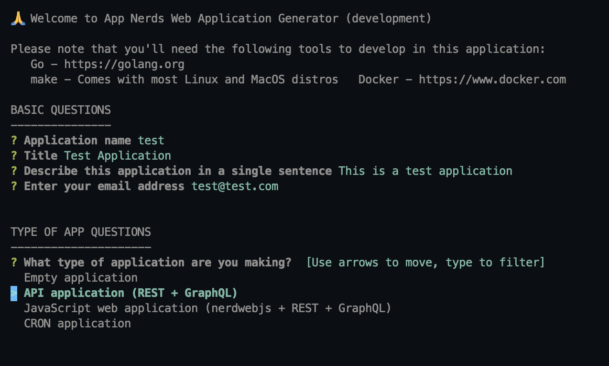

# App Nerds Web Application Generator

The **App Nerds Web Application Generator**, or *anwag*, is a tool to generate and scaffold a web application written in Go and and NerdwebJS. The stack looks a little something like the following.

* Go 1.18 for building your API
  * Build RESTful endpoints using [Nerdweb](https://github.com/app-nerds/nerdweb)
  * Build GraphQL APIs using [gqlgen](https://gqlgen.com)
* [NerdwebJS](https://github.com/app-nerds/nerdwebjs) for building basic, vanilla-JS SPA web applications

## Installation

```
go install github.com/app-nerds/anwag@latest
```

## Usage

To use **anwag** simply run the following in your terminal.

```bash
anwag
```

You will receive a series of prompts. Answer the questions. Once complete you should see a screen like the one below.



